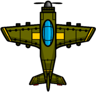

# Team 3

# To Run
`python3 game.py`

# Requirements
- python3
- pygame `python3 -m pip install -U pygame`

# Assets

# Sources
- https://ak.picdn.net/shutterstock/videos/1036373483/thumb/1.jpg
- https://wallpaper.dog/large/10896556.png
- https://cartoonsmartstreaming.s3.amazonaws.com/wp-content/uploads/2014/12/05001234/plane_preview.png
- https://www.vhv.rs/dpng/d/118-1189537_clouds-png-animated-cute-cartoon-cloud-png-transparent.png
